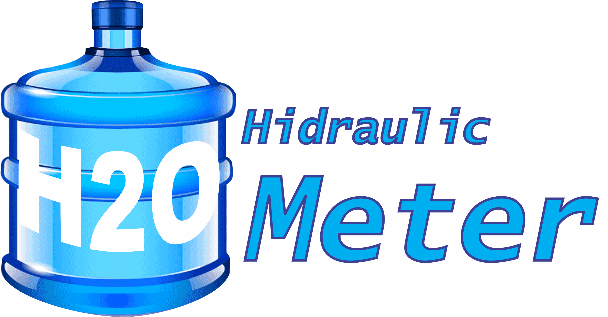
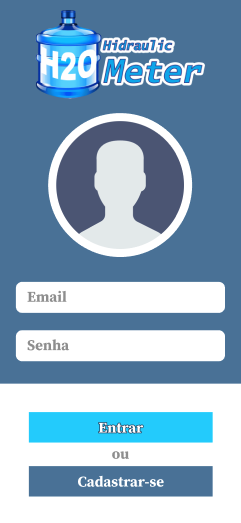
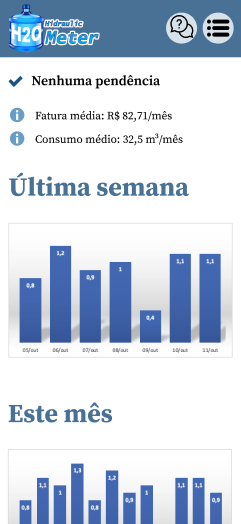

<h1 align="center">
  
</h1>

<p align="center">🌎 Um protótipo para gestão de gastos hídricos!</p>

<br />

<p align="center">
  <kbd>
    
  </kbd>
  &nbsp;&nbsp;&nbsp;&nbsp;
  <kbd>
    
  </kbd>
  &nbsp;&nbsp;&nbsp;&nbsp;
  <kbd>
    
  </kbd>
</p>

<br />

# ⚙️ Tecnologias

As seguintes ferramentas foram usadas na construção do projeto:

- [Figma](https://www.figma.com/file/7fH1omPu0n1gNlElgn5oUu/prototipa%C3%A7%C3%A3o?node-id=0%3A1)
- [Flutter](https://flutter.dev/)

<br />

# 👨‍💻 Desenvolvimento

Certifique-se de ter as extensões [Dart](https://marketplace.visualstudio.com/items?itemName=Dart-Code.dart-code) e [Flutter](https://marketplace.visualstudio.com/items?itemName=Dart-Code.flutter) instaladas no [VS Code](https://code.visualstudio.com/download).

Clone este repositório em um diretório de sua preferência:

```bash
cd ../minha-pasta
git clone https://github.com/samuelpietra/h2ometer
```

Abra o projeto no VS Code:
```bash
code h2ometer
```

<br />

# 📝 Padronização de branches

Opte sempre por [conventional commits](https://www.conventionalcommits.org/) ao idealizar um projeto em equipe, pensando sempre em sua escalabilidade e clean code:

<ul>
  <li><strong>feature/</strong>nome-da-branch</li>
  <li><strong>hotfix/</strong>nome-da-branch</li>
  <li><strong>release/</strong>nome-da-branch</li>
</ul>

<br />

# 📝 Padronização de commits

1. <strong>build:</strong> Alterações que afetam o sistema de construção ou dependências externas (escopos de exemplo: gulp, broccoli, npm),
2. <strong>ci:</strong> Changes to our CI configuration files and scripts (example scopes: Travis, Circle, BrowserStack, SauceLabs);
3. <strong>docs:</strong> referem-se a inclusão ou alteração somente de arquivos de documentação;
4. <strong>feat:</strong> Tratam adições de novas funcionalidades ou de quaisquer outras novas implantações ao código;
5. <strong>fix:</strong> Essencialmente definem o tratamento de correções de bugs;
6. <strong>perf:</strong> Uma alteração de código que melhora o desempenho;
7. <strong>refactor:</strong> Tipo utilizado em quaisquer mudanças que sejam executados no código, porém não alterem a funcionalidade final da tarefa impactada;
8. <strong>style:</strong> Alterações referentes a formatações na apresentação do código que não afetam o significado do código, como por exemplo: espaço em branco, formatação, ponto e vírgula ausente etc.);
9. <strong>test:</strong> Adicionando testes ausentes ou corrigindo testes existentes nos processos de testes automatizados (TDD);
10. <strong>chore:</strong> Atualização de tarefas que não ocasionam alteração no código de produção, mas mudanças de ferramentas, mudanças de configuração e bibliotecas que realmente não entram em produção;
11. <strong>env:</strong> basicamente utilizado na descrição de modificações ou adições em arquivos de configuração em processos e métodos de integração contínua (CI), como parâmetros em arquivos de configuração de containers.

<br />

# 🧠 Contribuidores

<table>
  <tr>
    <td align="center"><a href="https://github.com/samuelpietra"><br /><sub><b>Samuel Pietra</b></sub></a><br /></td>
  </tr>
</table>
